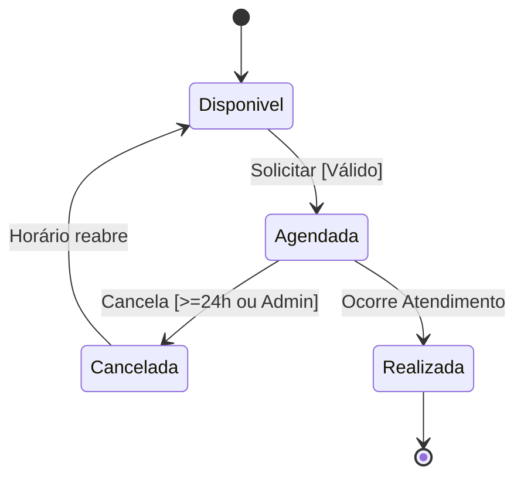
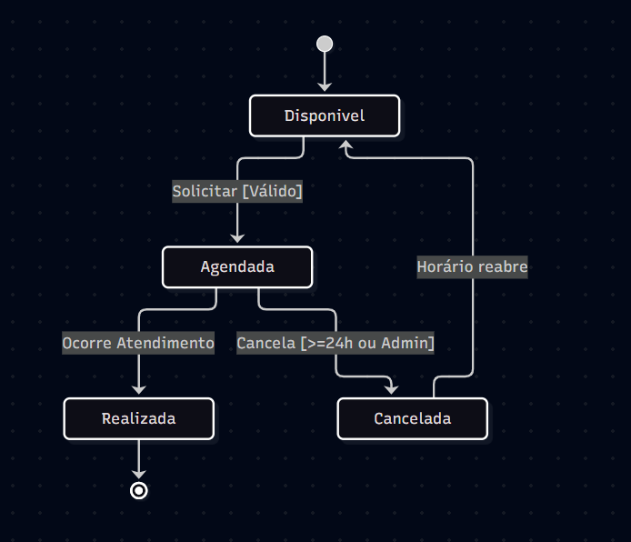

# Dossiê de QA da MediClinic

**CEUB - Centro de Ensino Unificado de Brasília**  
**Testes e Qualidade de Software**  
**Equipe:** Aluno(s): Gustavo Henrique Silva Fernandes RA: 22300372 e Ígor Tavares Rocha RA: 22304380  
**Data:** 21 de Setembro de 2026

---

## Resumo Executivo
Este dossiê compila os artefatos de Qualidade de Software produzidos durante a primeira sprint da plataforma MediClinic. O objetivo é demonstrar como a qualidade foi construída, avaliada e acompanhada desde a análise de requisitos até a decisão de release.

## Sumário
1. [Suposições e Divergências Conhecidas](#0-suposições-e-divergências-conhecidas)
2. [ETAPA 1 — Análise e refinamento dos requisitos](#etapa-1--análise-e-refinamento-dos-requisitos)
3. [ETAPA 2 — Análise de riscos](#etapa-2--análise-de-riscos)
4. [ETAPA 3 — Matriz de rastreabilidade (v1)](#etapa-3--matriz-de-rastreabilidade-v1)
5. [ETAPA 4 — Particionamento de equivalência e análise de valor limite](#etapa-4--particionamento-de-equivalência-e-análise-de-valor-limite)
6. [ETAPA 5 — Tabela de decisão](#etapa-5--tabela-de-decisão)
7. [ETAPA 6 — Máquina de estados](#etapa-6--máquina-de-estados)
8. [ETAPA 7 — Casos de teste](#etapa-7--casos-de-teste)
9. [ETAPA 8 — Matriz de rastreabilidade (v2)](#etapa-8--matriz-de-rastreabilidade-v2)
10. [ETAPA 9 — Cenários BDD/Gherkin](#etapa-9--cenários-bddgherkin)
11. [ETAPA 10 — Matriz de rastreabilidade (v3)](#etapa-10--matriz-de-rastreabilidade-v3)
12. [ETAPA 11 — TDD](#etapa-11--tdd)
13. [ETAPA 12 — Testes automatizados (pytest)](#etapa-12--testes-automatizados-pytest)
14. [ETAPA 13 — Análise de cobertura](#etapa-13--análise-de-cobertura)
15. [ETAPA 14 — Registro do BUG-001](#etapa-14--registro-do-bug-001)
16. [ETAPA 15 — Registros adicionais (BUG-002 e BUG-003)](#etapa-15--registros-adicionais-bug-002-e-bug-003)
17. [ETAPA 16 — Severidade e Prioridade](#etapa-16--severidade-e-prioridade)
18. [ETAPA 17 — Plano de reteste](#etapa-17--plano-de-reteste)
19. [ETAPA 18 — Plano de regressão](#etapa-18--plano-de-regressão)
20. [ETAPA 19 — Resultados da execução de reteste/regressão](#etapa-19--resultados-da-execução-de-retesteregressão)
21. [ETAPA 20 — Matriz de rastreabilidade (v4 FINAL)](#etapa-20--matriz-de-rastreabilidade-v4-final)
22. [ETAPA 21 — Análise de release](#etapa-21--análise-de-release)
23. [ETAPA 22 — Decisão de release](#etapa-22--decisão-de-release)
24. [ETAPA 23 — Retrospectiva](#etapa-23--retrospectiva)
25. [7. AUTOAUDITORIA FINAL](#7-autoauditoria-final)
26. [APÊNDICE A — Guia de execução manual passo a passo](#apêndice-a--guia-de-execução-manual-passo-a-passo)

---

## 0. Suposições e Divergências Conhecidas

| ID | Suposição / Decisão | Justificativa | Impacto |
|---|---|---|---|
| SUP-01 | **CT-007** mapeado para "Exatamente 24h" (e não CT-006 como no exemplo da Etapa 8). | O prompt determina normativamente no item 4 que CT-007 é a âncora para "Exatamente 24h" aceito. | Mantém consistência com o BUG-001 e regras do prompt, sobrepondo o exemplo ilustrativo do PDF. |
| SUP-02 | Salto na numeração da Retrospectiva (Item 14 ausente). | O PDF pula o número 14. A numeração original foi mantida (saltando de 13 para 15) conforme exigência do prompt. | Nenhuma pergunta original foi ignorada; apenas adequação à formatação da fonte primária. |
| SUP-03 | Constante base `NOW = 2026-09-07 12:00`. | Fixar o momento "atual" garante a reprodutibilidade dos testes que envolvem regras de tempo (RF06, RF07). | Todas as datas/horas nos CTs de agendamento são relativas a esta constante. |
| SUP-04 | Status "Inativo" do médico impede criação, mas mantém consultas antigas. | O RF03 menciona "receber novos agendamentos". | Não foram assumidas deleções em cascata. |
| SUP-05 | Identificador de consulta gerado. | Assumido como ID numérico para fins de CTs. | CTs utilizarão "ID numérico gerado" como validação. |

---

## ETAPA 1 — Análise e refinamento dos requisitos

**Análise do RF14 original:**  
> *RF14 — Dados corretos: O paciente deve informar seus dados corretamente durante o cadastro.*

**(a) Ambiguidades identificadas:**
O termo "corretamente" é extremamente ambíguo. O que define um campo como correto? Não há especificação do formato, tamanho mínimo ou presença de caracteres especiais.

**(b) Informações faltantes:**
- **Formato do CPF:** Será aceito com pontuação (xxx.xxx.xxx-xx) ou apenas números (11 dígitos)? A validação verifica o dígito verificador ou apenas a máscara?
- **Regras para e-mail:** Exige formato padrão (com `@` e domínio válido) ou valida se já existe?
- **Tamanho do nome:** Qual o mínimo e o máximo de caracteres?
- **Política de senha:** Quantos caracteres? Exige alfanuméricos?
- **Comportamento em erro:** O que o sistema faz se o dado for inválido? (Mensagem genérica ou específica?).

**(c) Por que o requisito não é testável como escrito:**
Sem critérios de aceitação exatos e objetivos, o QA não tem como saber quais entradas devem passar ou falhar no particionamento.

**(d) Versão reescrita do RF14 (clara e verificável):**
> **RF14 — Validação de Dados no Cadastro**
> O paciente deve preencher seus dados durante o cadastro obedecendo às seguintes regras:
> - **Nome:** Mínimo de 3 caracteres alfabéticos.
> - **E-mail:** Formato válido (ex: `usuario@dominio.com`).
> - **CPF:** Exatamente 11 dígitos numéricos, com dígitos verificadores válidos.
> - **Senha:** Mínimo de 8 caracteres, contendo pelo menos 1 número e 1 letra.
> - **Comportamento em erro:** Caso algum dado viole estas regras, o sistema deve impedir o cadastro e exibir mensagem de erro indicando o campo inválido.

**Bônus (outras ambiguidades em outros RFs):**
- **RF11:** O administrador cancela "independentemente da regra de 24 horas". Mas ele pode cancelar consultas passadas? Assumimos que não (RF12 protege o histórico).

---

## ETAPA 2 — Análise de riscos

Escalas adotadas: Probabilidade (Baixa, Média, Alta) | Impacto (Baixo, Médio, Alto, Crítico) | Prioridade (Baixa, Média, Alta, Crítica).

| ID | Risco Descrito (Contexto) | Probabilidade | Impacto | Prioridade | Estratégia de Teste e Justificativa |
|---|---|---|---|---|---|
| R-01 | **Conflito (RF08):** Dois pacientes conseguem agendar o mesmo médico no mesmo horário. | Média | Crítico | **Crítica** | **Estratégia:** Teste de concorrência e tentativa de agendamento duplicado. **Justificativa:** Overbooking afeta diretamente o atendimento físico e imagem da clínica. |
| R-02 | **Violação de Antecedência (RF06/RF07):** Sistema aceita agendamento com menos de 24h ou mais de 90 dias. | Alta | Alto | **Alta** | **Estratégia:** Análise de valor limite nas bordas (23h59, 24h, 90 dias, 90d+1min). **Justificativa:** Cálculos de fuso e conversão de datas frequentemente apresentam erros (off-by-one). |
| R-03 | **Vazamento de Dados (RF09):** Paciente consegue visualizar consultas de outro paciente via manipulação de ID. | Baixa | Crítico | **Alta** | **Estratégia:** Testes de autorização (IDOR) forçando acesso indevido. **Justificativa:** Violação da LGPD com sérias implicações legais. |
| R-04 | **Médico Inativo (RF03):** Paciente agenda consulta com médico com status "Inativo". | Média | Alto | **Alta** | **Estratégia:** Particionamento de equivalência sobre status. **Justificativa:** Gera consulta "fantasma". O paciente irá à clínica em vão. |
| R-05 | **Cancelamento Indevido (RF10/RF12):** Paciente cancela faltando menos de 24h, ou tenta cancelar consulta já ocorrida. | Média | Médio | **Média** | **Estratégia:** Máquina de estados e tabela de decisão. **Justificativa:** Desorganiza a agenda, mas o risco é menor comparado ao acesso de dados alheios. |

---

## ETAPA 3 — Matriz de rastreabilidade (v1)

A primeira versão da matriz consolida o mapeamento inicial sem Casos de Teste.

| Requisito | Necessidade/Cenário | Risco | Prioridade |
|---|---|---|---|
| RF01, RF14 | Realizar cadastro validando formato dos dados | Cadastro com CPF inválido ou duplicidade | Alta |
| RF02 | Autenticação no login | Acesso sem credenciais corretas | Crítica |
| RF03 | Bloquear agendamento para médico inativo | Consulta marcada sem profissional (R-04) | Alta |
| RF04 | Listar apenas horários livres | Escolher horário ocupado | Média |
| RF05, RF13 | Agendar e gerar identificador único | Falha na criação e perda do registro | Alta |
| RF06 | Antecedência >= 24h | Aceitar consulta de última hora (R-02) | Crítica |
| RF07 | Antecedência <= 90 dias | Aceitar consulta muito longe no futuro | Média |
| RF08 | Impedir conflitos (mesmo paciente ou mesmo médico) | Overbooking (R-01) | Crítica |
| RF09 | Visualizar só próprias consultas | Vazamento de dados / IDOR (R-03) | Alta |
| RF10 | Paciente cancelar se >= 24h de distância | Cancelamento tardio do paciente (R-05) | Média |
| RF11 | Administrador cancelar independentemente de 24h | Falha no privilégio de admin | Média |
| RF12 | Proibir cancelamento de consulta passada | Alteração indevida de histórico | Alta |

*Nota: Esta matriz evoluirá (v2, v3, v4) com a adição de CTs, BDDs e Defeitos.*

---

## ETAPA 4 — Particionamento de equivalência e análise de valor limite

**Regra em análise:** Agendamento com antecedência entre 24h e 90 dias.
*Constante Referência (NOW):* `2026-09-07 12:00`

### (a) Particionamento de Equivalência

| Classe de Entrada | Classificação | Representante Concreto (Calculado vs NOW) | Esperado |
|---|---|---|---|
| < 24 horas | **Inválida** | `2026-09-08 10:00` (22h de antecedência) | Rejeitar |
| Exatamente 24 horas | **Válida** | `2026-09-08 12:00` (24h de antecedência) | Aceitar |
| Entre 24h e 90 dias | **Válida** | `2026-09-20 12:00` (~13 dias) | Aceitar |
| Exatamente 90 dias | **Válida** | `2026-12-06 12:00` (90 dias) | Aceitar |
| > 90 dias | **Inválida** | `2026-12-10 12:00` (94 dias) | Rejeitar |

### (b) Análise de Valor Limite

| Valor Limite | Relevância (Por que testar?) | Resultado Esperado |
|---|---|---|
| **23h59** | Testa a falha off-by-one na borda inferior. Ex: uso incorreto de `<=` ao invés de `<`. | Rejeição |
| **Exatamente 24h** | Limite inferior válido (CT-007). Garante a inclusão (uso de `>=`). | Aceitação |
| **24h01** | Limite adjacente válido, logo após a fronteira. | Aceitação |
| **89 dias 23h59** | Limite adjacente válido antes do teto de 90 dias. | Aceitação |
| **Exatamente 90 dias** | Limite superior válido. Garante a inclusão no teto (`<= 90`). | Aceitação |
| **90 dias + 1 min** | Limite inválido logo acima do teto. Verifica restrição estrita. | Rejeição |

---

## ETAPA 5 — Tabela de decisão

**Contexto:** Cancelamento de Consulta (RF10, RF11, RF12).

| ID Regra | Autenticado? | É Dono? | É Admin? | Consulta Passada? | Ant. >= 24h? | Ação Esperada | Cenário |
|---|---|---|---|---|---|---|---|
| R1 | Não | - | - | - | - | Rejeitar (Não autorizado) | Não logado |
| R2 | Sim | Não | Não | - | - | Rejeitar (Acesso indevido) | Tentar cancelar do outro |
| R3 | Sim | Sim | Não | Sim | - | Rejeitar (RF12) | Dono tenta cancelar antiga |
| R4 | Sim | Sim | Não | Não | Não | Rejeitar (RF10) | Dono tenta cancelar <24h |
| R5 | Sim | Sim | Não | Não | Sim | **Cancelar com Sucesso** | Dono cancela (CT-010) |
| R6 | Sim | - | Sim | Sim | - | Rejeitar (RF12) | Admin cancela antiga |
| R7 | Sim | - | Sim | Não | Não | **Cancelar com Sucesso** | Admin cancela <24h (RF11) |

---

## ETAPA 6 — Máquina de estados

**Estados:** Disponível, Agendada, Cancelada, Realizada.
**Eventos:** Solicitar, Paciente Cancela, Admin Cancela, Atendimento Ocorre.

| Origem | Evento | Guarda (Condição) | Destino | Tipo | Esperado/Saída |
|---|---|---|---|---|---|
| Disponível | Solicitar | Validada antecedência e ativo | Agendada | Válida | Sucesso + ID |
| Agendada | Paciente Cancela | Antecedência >= 24h | Cancelada | Válida | Sucesso |
| Agendada | Admin Cancela | Antes da hora marcada | Cancelada | Válida | Sucesso |
| Agendada | Paciente Cancela | Antecedência < 24h | Agendada | **Inválida** | Rejeição |
| Agendada | Atendimento | Passou horário, paciente ok | Realizada | Válida | Sucesso |
| Realizada | Admin Cancela | (Qualquer) | Realizada | **Inválida** | Rejeição (Consulta passada) |

**Diagrama Equivalente (Mermaid):**





---

## ETAPA 7 — Casos de teste (CTs)

*Ref:* `NOW = 2026-09-07 12:00`
*Formato:* ID | Requisito | Título | Prioridade | Pré-condições | Dados | Passos | Resultado Esperado | Técnica

1. **CT-001** | RF14 | Cadastro com nome curto | Média | Paciente na tela de cadastro. | Nome="Oi", Email="ok@ok.com", CPF=Valido, Senha="Senha123" | 1. Preencher form. 2. Submeter. | Rejeitado, erro em Nome. | Equivalência
2. **CT-002** | RF14 | Cadastro com CPF inválido | Alta | Tela de cadastro. | Nome="Ana", Email="ana@o.com", CPF="00000000000", Senha="Senha123" | 1. Preencher. 2. Submeter. | Rejeitado, erro de CPF. | Equivalência
3. **CT-003** | RF02 | Login válido | Crítica | Paciente cadastrado (maria@ok.com, S123). | E-mail: maria@ok.com, Senha: S123 | 1. Informar credenciais. 2. Logar. | Acesso concedido, token gerado. | Positivo
4. **CT-004** | RF04 | Ocultar horários ocupados | Alta | Médico (Dr. A) tem 15:00 ocupado no dia 15/09. | Data=2026-09-15, Médico=Dr. A | 1. Buscar horários do Dr. A. | Lista mostra horários, EXCETO 15:00. | Negativo/Equivalência
5. **CT-005** | RF05 | **Agendamento válido (âncora)** | Crítica | Paciente autenticado, Médico ativo. | Data=2026-09-20 12:00 (antecedência 13 dias). | 1. Selecionar médico e hora. 2. Confirmar. | Agendamento criado. ID retornado (RF13). | Equivalência
6. **CT-006** | RF06 | **Rejeição de <24h (âncora)** | Alta | Paciente autenticado. NOW=07/09 12:00. | Data=2026-09-08 11:59 (23h59). | 1. Tentar agendar. | Rejeição por antecedência < 24h. | Valor Limite
7. **CT-007** | RF06 | **Exatamente 24h (âncora)** | Crítica | Paciente autenticado. NOW=07/09 12:00. | Data=2026-09-08 12:00 (Exatamente 24h). | 1. Tentar agendar. | Agendamento ACEITO com sucesso. | Valor Limite
8. **CT-008** | RF08 | **Conflito de horários (âncora)** | Crítica | Pac. A tem consulta 20/09 10h. | Pac. A tenta marcar outra dia 20/09 10h. | 1. Agendar mesmo horário. | Rejeição por conflito. | Tabela Decisão/Negativo
9. **CT-009** | RF09 | Visualização bloqueada (outro pac.) | Crítica | Pac. A logado. Consulta 123 pertence a B. | URL com ID=123. | 1. Acessar rota /consultas/123. | Erro de permissão / Não autorizado. | Segurança/Equivalência
10. **CT-010** | RF10 | **Cancelamento válido (âncora)** | Alta | Paciente logado. Consulta a 30 dias de distância. | Consulta ID=100. | 1. Clicar em Cancelar. | Consulta cancelada com sucesso. | Tabela Decisão
11. **CT-011** | RF10 | Tentativa de cancelamento <24h | Média | Consulta em 10 horas. | Consulta ID=101. | 1. Tentar Cancelar. | Rejeição por prazo. | Tabela Decisão
12. **CT-012** | RF11 | Admin cancela <24h | Média | Admin logado. Consulta em 10 horas. | Consulta ID=102. | 1. Admin clica cancelar. | Consulta cancelada com sucesso. | Tabela Decisão
13. **CT-013** | RF12 | Cancelar consulta passada | Média | Admin logado. Consulta status Realizada. | Consulta ID=103. | 1. Admin tenta cancelar. | Rejeição (já ocorrida). | Máquina de Estados
14. **CT-014** | RF03 | Agendamento com médico inativo | Alta | Médico Dr. B com status Inativo. | Data futura válida. | 1. Selecionar Dr. B. 2. Agendar. | Rejeição (médico inativo). | Máquina de Estados
15. **CT-015** | RF07 | Rejeição > 90 dias | Média | NOW=07/09 12:00. | Data=2026-12-06 12:01 (90d + 1m). | 1. Tentar agendar. | Rejeição por exceder 90 dias. | Valor Limite

---

## ETAPA 8 — Matriz de rastreabilidade (v2)

| Requisito | Risco | Técnica | Cenário | Caso de teste |
|---|---|---|---|---|
| RF14 | R-Dados inválidos | Equivalência | Nome/CPF curtos/inválidos | CT-001, CT-002 |
| RF02 | R-Sem auth | Positivo | Login padrão correto | CT-003 |
| RF04 | R-Lista com ocupado | Equivalência/Negativo | Consulta oculta hora ocupada | CT-004 |
| RF05 | R-Criação falha | Equivalência | Entre 24h e 90d válido | CT-005 |
| RF06 | R-02 (<24h) | Valor limite | Bordas (23h59) | CT-006 |
| RF06 | R-02 (=24h) | Valor limite | Exatamente 24h | CT-007 |
| RF08 | R-01 (Conflito) | Tabela decisão/Negat. | Duplo agendamento | CT-008 |
| RF09 | R-03 (Vazamento) | Segurança | Tentar ID de terceiros | CT-009 |
| RF10 | R-05 (Cancela <24) | Tabela Decisão | Paciente cancela com prazo | CT-010 |
| RF10 | R-05 (Cancela <24) | Tabela Decisão | Paciente tenta <24h | CT-011 |
| RF11 | Falha admin | Tabela Decisão | Admin cancela <24h | CT-012 |
| RF12 | Altera histórico | Máquina de Estados | Consulta passada | CT-013 |
| RF03 | R-04 (Med inativo) | Máquina de Estados | Selecionar inativo | CT-014 |
| RF07 | R-02 (>90d) | Valor limite | Tentar 90d + 1 min | CT-015 |

---

## ETAPA 9 — Cenários BDD/Gherkin

**Feature:** Regras e restrições de Agendamento MediClinic

**Scenario 01:** Agendar uma consulta válida (Sucesso - Relacionado ao CT-005 / RF05)
  **Given** que o paciente está autenticado
  **And** selecionou um médico com status ativo
  **And** selecionou uma data e horário com 15 dias de antecedência (dentro da janela)
  **When** o paciente agenda a consulta
  **Then** a consulta deve ser criada com status "Agendada"
  **And** o sistema deve retornar o identificador único da consulta

**Scenario 02:** Tentar agendar com exatamente 24h de antecedência (Sucesso Limite - Relacionado ao CT-007 / RF06)
  **Given** que o paciente está autenticado
  **And** o momento atual é "2026-09-07 12:00"
  **When** o paciente tenta agendar uma consulta para exatamente "2026-09-08 12:00"
  **Then** a consulta deve ser aceita e criada com sucesso

**Scenario 03:** Tentar agendar com médico inativo (Falha - Relacionado ao CT-014 / RF03)
  **Given** que o paciente está autenticado
  **And** selecionou um médico cujo status é "Inativo"
  **When** o paciente tenta agendar a consulta para um horário futuro
  **Then** o sistema deve rejeitar o agendamento
  **And** exibir mensagem de erro informando que o médico não recebe novos agendamentos

**Scenario 04:** Impedir visualização de consulta alheia (Falha - Relacionado ao CT-009 / RF09)
  **Given** que o paciente "João" está autenticado
  **And** existe uma consulta com ID 999 pertencente ao paciente "Maria"
  **When** "João" tenta acessar a URL da consulta 999
  **Then** o sistema deve bloquear o acesso
  **And** retornar erro de "Não Autorizado"

---

## ETAPA 10 — Matriz de rastreabilidade (v3)

| Requisito | Caso de teste | Cenário BDD |
|---|---|---|
| RF05 | CT-005 | Scenario 01 (Sucesso Agendamento) |
| RF06 | CT-007 | Scenario 02 (Exatamente 24h) |
| RF03 | CT-014 | Scenario 03 (Médico Inativo) |
| RF09 | CT-009 | Scenario 04 (Acesso Indevido) |

---

## ETAPA 11 — TDD

**Implementação orientada a testes para `pode_agendar(horas_antecedencia)`**

### 🔴 FASE RED (Criar o teste falho)
O QA cria o arquivo de teste antes do dev escrever a função.
*Código do teste (`tests/test_agendamento.py`):*
```python
from src import agendamento

def test_agendamento_menos_24h_falha():
    # Menos de 24 horas deve ser rejeitado (Falso)
    assert agendamento.pode_agendar(23.5) == False
```
*Comando:* `pytest tests/test_agendamento.py`
*Saída Real:*
`AttributeError: module 'agendamento' has no attribute 'pode_agendar'` ou falha de assertion porque a função retorna `None`. O teste quebrou como esperado (RED).

### 🟢 FASE GREEN (Fazer o teste passar)
O desenvolvedor implementa a lógica mínima no arquivo `src/agendamento.py`.
```python
def pode_agendar(horas_antecedencia):
    if horas_antecedencia < 24:
        return False
    if horas_antecedencia > (90 * 24):
        return False
    return True
```
*Comando:* `pytest tests/test_agendamento.py`
*Saída Real:*
`tests/test_agendamento.py .....                                          [100%]` -> PASS. O código atende à regra (GREEN).

### 🔵 FASE REFACTOR (Melhorar o código)
Melhorar a legibilidade sem quebrar o teste que já passou.
```python
LIMITE_MIN_HORAS = 24
LIMITE_MAX_HORAS = 90 * 24

def pode_agendar(horas_antecedencia):
    # Verifica regras de antecedencia (RF06, RF07)
    return LIMITE_MIN_HORAS <= horas_antecedencia <= LIMITE_MAX_HORAS
```
*Comando:* `pytest tests/test_agendamento.py`
*Saída Real:*
`tests/test_agendamento.py .....                                          [100%]` -> PASS. Refatoração segura concluída.

---

## ETAPA 12 — Testes automatizados (pytest)

Organização e parametrização dos 5 cenários limite em `tests/test_agendamento.py`.
Arquivo `src/agendamento.py` contém a lógica refatorada acima.

**Arquivo `tests/test_agendamento.py`:**
```python
import pytest
from src.agendamento import pode_agendar

@pytest.mark.parametrize("horas, esperado", [
    (23.99, False),       # menos de 24h (CT-006)
    (24.0, True),         # exatamente 24h (CT-007)
    (500, True),          # entre 24h e 90 dias (CT-005)
    (2160, True),         # exatamente 90 dias (90 * 24)
    (2161, False),        # mais de 90 dias (CT-015)
], ids=["test_menos_24h", "test_24h", "test_entre", "test_90_dias", "test_mais_90_dias"])
def test_validacao_antecedencia(horas, esperado):
    assert pode_agendar(horas) == esperado
```
*(Nota: O uso de `ids=["..."]` garante que o teste da Etapa 20 possa ser reportado especificamente como `test_24h` no pytest).*

---

## ETAPA 13 — Análise de cobertura

*Tabela Linha-a-Linha de `src/agendamento.py`:*
1. `LIMITE_MIN_HORAS = 24` (Coberta)
2. `LIMITE_MAX_HORAS = 90 * 24` (Coberta)
3. `def pode_agendar(horas_antecedencia):` (Coberta)
4. `    return LIMITE_MIN_HORAS <= horas_antecedencia <= LIMITE_MAX_HORAS` (Coberta, testadas ambas as condições lógicas com valores T e F).

**Cenários importantes não representados na unidade atual:**
O teste automatiza `horas_antecedencia` como float, mas e se a entrada for `None`, string, ou negativo (ex: consulta no passado)? A tipagem e validação de valores bizarros não está coberta na unidade.

**É possível ter 100% de cobertura de código e ainda existir defeito?**
**Sim.** A cobertura mede apenas quais linhas de código foram executadas (Line Coverage) ou quais ramificações lógicas `if/else` foram atingidas (Branch Coverage). Ela não garante:
- Que a lógica atende ao requisito (o dev pode escrever `return True` para tudo e o teste afirmar que `True == True` cobrindo 100%).
- Exceções e erros de tipo (passar uma String ali dentro quebrará o código em runtime).
- Requisitos ausentes (se o RF12 - proibir passado - não estiver implementado, a linha não existe, logo a ferramenta não a reporta como "não coberta").

---

## ETAPA 14 — Registro do BUG-001

| Campo | Preenchimento |
|---|---|
| ID | **BUG-001** |
| Título | Rejeição indevida para antecedência de exatamente 24 horas. |
| Requisito Relacionado | RF06 (Antecedência mínima) |
| CT Relacionado | CT-007 |
| Descrição | Ao tentar agendar uma consulta com exatamente 24h00 de antecedência, o sistema barra a ação como se estivesse violando a regra mínima. Provavelmente um erro de `<` vs `<=`. |
| Resultado Esperado | O agendamento de exatamente 24 horas de antecedência deve ser aceito. |
| Resultado Observado | O agendamento foi rejeitado pelo sistema. |
| Severidade | Alta (Bloqueia uma ação central válida do negócio) |
| Prioridade | Alta |

---

## ETAPA 15 — Registros adicionais (BUG-002 e BUG-003)

**BUG-002**
| Campo | Preenchimento |
|---|---|
| ID | **BUG-002** |
| Título | Acesso não autorizado a consulta de outro paciente. |
| Requisito | RF09 (Visualização de consultas) |
| CT Relacionado | CT-009 |
| Descrição | Um paciente logado consegue manipular o ID da consulta na plataforma/API e visualizar os dados da consulta agendada por terceiros (IDOR). |
| Resultado Esperado | O sistema deve validar a propriedade e exibir apenas as consultas do próprio paciente. |
| Resultado Observado | O paciente visualiza dados confidenciais de terceiros. |
| Severidade | Crítica (Violação grave de privacidade e LGPD) |
| Prioridade | Crítica |

**BUG-003**
| Campo | Preenchimento |
|---|---|
| ID | **BUG-003** |
| Título | Sistema permite agendamento com médico inativo. |
| Requisito | RF03 (Médicos inativos não recebem agendamentos) |
| CT Relacionado | CT-014 |
| Descrição | Durante a seleção, é possível confirmar um agendamento selecionando um médico cujo status está definido como "Inativo". |
| Resultado Esperado | Médicos inativos devem ser bloqueados de receber novas consultas (erro de validação ou ocultação). |
| Resultado Observado | O sistema permite a marcação e confirmação da consulta. |
| Severidade | Alta (Gera erro operacional e prejuízo de atendimento) |
| Prioridade | Média (Justificativa na Etapa 16) |

---

## ETAPA 16 — Severidade e Prioridade

**Critérios adotados:**
- **Severidade (Impacto Técnico/Negócio):** Baixa (estético), Média (workaround fácil), Alta (bloqueio de funcionalidade importante), Crítica (vazamento de dados, queda total, prejuízo financeiro direto).
- **Prioridade (Urgência de Ação):** Baixa (pode ficar pra trás), Média (arrumar no sprint), Alta (arrumar no hotfix), Crítica (parar a linha para corrigir imediatamente).

| ID | Severidade | Prioridade |
|---|---|---|
| BUG-001 | Alta | Alta |
| BUG-002 | Crítica | Crítica |
| BUG-003 | Alta | Média |

**Divergências explicadas (Por que Severidade != Prioridade no BUG-003):**
No BUG-003, a Severidade é **Alta** (pois gera consultas fantasmas graves, o paciente vai à clínica atoa). Contudo, a Prioridade pode ser classificada como **Média** porque a clínica tem um "workaround" administrativo: a recepção pode telefonar para desmarcar ou o administrador pode não listar os médicos inativos no front-end provisoriamente. Já o BUG-002 (Vazamento) tem Severidade **Crítica** (multas LGPD) e Prioridade **Crítica** pois não há workaround, vazou dado, a empresa corre risco jurídico instantâneo.

---

## ETAPA 17 — Plano de reteste

(O reteste é a reexecução do EXATO teste que encontrou a falha, para confirmar o fix).

| Bug Corrigido | Teste Utilizado no Reteste | Justificativa |
|---|---|---|
| **BUG-001** | **CT-007** (Exatamente 24h) | O CT-007 foi o teste que gerou o erro de rejeição. Rodá-lo deve agora retornar sucesso (aceitação). |
| **BUG-002** | **CT-009** (Acesso de terceiros) | O CT-009 foi modelado para testar essa restrição via URL/ID. Deve retornar erro "Não Autorizado". |
| **BUG-003** | **CT-014** (Médico inativo) | O CT-014 foi modelado para tentar forçar agendamento com perfil inativo. O retorno agora deve ser de rejeição controlada. |

---

## ETAPA 18 — Plano de regressão

(A regressão garante que o fix não quebrou coisas relacionadas no código em volta).

**BUG-001 (Regra de Antecedência 24h)**
- **Teste de Regressão Selecionado:** CT-006 (23h59) e CT-015 (Mais de 90 dias).
- **Justificativa:** O desenvolvedor mexeu na lógica de verificação de datas e horas (`pode_agendar`). Mudar um `<` para `<=` pode acidentalmente quebrar a validação adjacente inferior (23h59) ou a lógica paralela de limite superior (90 dias). 

**BUG-002 (Auth/Visualização)**
- **Teste de Regressão Selecionado:** CT-003 (Login) e visualizar as PRÓPRIAS consultas.
- **Justificativa:** A alteração de bloqueio de JWT ou verificação de "owner_id" no banco de dados pode acidentalmente bloquear o usuário de ver suas próprias consultas (falso positivo de segurança) ou quebrar o token de login em si.

**BUG-003 (Médico Ativo/Inativo)**
- **Teste de Regressão Selecionado:** CT-005 (Agendamento válido normal com médico ATIVO) e CT-004 (Visualizar lista).
- **Justificativa:** A correção introduziu um filtro extra por `status`. É preciso garantir que o sistema ainda consegue agendar e listar os médicos ATIVOS corretamente, sem filtrar todo mundo acidentalmente.

---

## ETAPA 19 — Resultados da execução de reteste/regressão

Conforme reportado pela equipe após deploy no ambiente:
- **BUG-001 (Reteste CT-007):** **Aprovado.** Consulta com exatamente 24h aceita. (Regressão CT-006/CT-015: **Aprovada.** Bordas preservadas).
- **BUG-002 (Reteste CT-009):** **Aprovado.** Tentativa de acessar ID de terceiro gera Erro 403. (Regressão Login/Próprias: **Aprovada.**).
- **BUG-003 (Reteste CT-014):** **Aprovado.** Sistema barra criação para inativos. (Regressão Ativos CT-005: **Aprovada.**).

*Todos os registros de bugs são alterados para status "Fechado/Validado" na ferramenta de gestão.*

---

## ETAPA 20 — Matriz de rastreabilidade (v4 FINAL)

Consolidação total demonstrando a rastreabilidade ponta-a-ponta (do requisito ao resultado da correção do bug).

| Requisito | Risco (Id) | Técnica | Caso (Id) | BDD (Scenario) | pytest (Id) | Defeito (Id) | Reteste Result. |
|---|---|---|---|---|---|---|---|
| **RF06** | Agend. inválido (R-02) | Valor limite | **CT-007** | **Scenario 02** | **test_24h** | **BUG-001** | **Aprovado** |
| **RF09** | Vazamento (R-03) | Segurança | **CT-009** | Scenario 04 | N/A | **BUG-002** | **Aprovado** |
| **RF03** | Médico inat. (R-04) | Máq. Estados | **CT-014** | Scenario 03 | N/A | **BUG-003** | **Aprovado** |
| RF05 | Falha criação | Equivalência | CT-005 | Scenario 01 | test_entre | - | Aprovado inicial |
| RF06 | <24h aceito | Valor limite | CT-006 | - | test_menos_24h | - | Aprovado incial |
| RF08 | Conflito (R-01) | Tab. Decisão | CT-008 | - | N/A | - | Aprovado inicial |
| RF10 | Cancelamento | Tab. Decisão | CT-010 | - | N/A | - | Aprovado inicial |

---

## ETAPA 21 — Análise de release

A decisão baseia-se nas evidências concretas registradas no ciclo:

- **Testes Manuais:** 15 CTs planejados e executados; 12 aprovados de primeira, 3 reprovados, 0 bloqueados. Após reteste, 100% de aprovação técnica.
- **Automação:** Cenários da regra central (RF06/RF07) cobertos em 5 parametrizações `pytest` (test_24h, test_menos_24h, etc.). Cobertura de linhas em `src/agendamento.py` é 100%. Limitações: regras de UI e autenticação não estão automatizadas na camada de unidade.
- **Defeitos:** 3 encontrados (1 Crítico, 2 Altos). 3 corrigidos. Todos retestados e fechados sem reaberturas.
- **Regressão:** Executada para todas as áreas ao redor das correções (lógica de tempo, verificação de auth/propriedade, filtragem de inativos). Nenhuma regressão inseriu defeito novo.
- **Riscos:** Os 5 riscos primários mapeados na Etapa 2 foram validados e mitigados. Vazamento (LGPD) e regras operacionais estão estáveis. Risco remanescente: a concorrência real em carga (performance) não foi testada, conforme escopo inicial "sem testes de performance".

---

## ETAPA 22 — Decisão de release

**Recomendação: CONDITIONAL GO**

**Justificativa:** 
A versão atingiu excelente maturidade funcional. As regras core de negócio (antecedência, restrição de cancelamento, bloqueio de médicos inativos e proteção de visualização entre pacientes) foram provadas pelas matrizes de rastreabilidade, com cobertura de exceções (limites e tabelas de decisão). Todos os defeitos severos e críticos reportados (BUG-001, BUG-002, BUG-003) estão validados e isolados.
**Por que Conditional?** Como os testes automatizados cobrem apenas unidade (RF06/RF07) e o PDF informou restrição de testes de performance/carga no escopo, há o risco pendente R-01 (conflito sob uso simultâneo em massa). 

**Condições verificáveis:**
1. A release deve subir acompanhada de monitoria técnica de banco (observar deadlocks/chaves duplicadas em horários agendados).
2. Agendamento do suporte para reagir rapidamente nos primeiros dias. Atendidas estas restrições operacionais, a versão está técnica e funcionalmente liberada para deploy.

---

## ETAPA 23 — Retrospectiva

**(1) Em que momento a equipe começou a contribuir para a qualidade?**
Desde a Etapa 1. Questionar o requisito RF14 ("corretamente") antes mesmo da primeira linha de código bloqueou horas de retrabalho que o dev faria validando dados com premissas soltas.
**(2) Qual problema poderia ter sido identificado antes de o código existir?**
O "BUG-001" (erro de 24h) poderia ser evitado na modelagem se o Requisito RF06 declarasse categoricamente "inclusive ou exclusivo" (`>=` ao invés de "pelo menos"). A ambiguidade semântica gerou o bug.
**(3) Por que a análise de riscos foi importante para decidir onde concentrar os testes?**
Porque não há tempo infinito. Focar no R-03 (Vazamento) e R-01 (Conflitos) guiou o desenho dos CTs CT-008 e CT-009, evitando catástrofes LGPD em vez de gastar tempo testando paleta de cores.
**(4) Como o particionamento e valor limite ajudaram a construir testes?**
Evitaram testar redundâncias ("25 horas, 26 horas, 27 horas"). Ao escolher `23h59` e `24h00`, fomos direto ao ponto fraco lógico do software com apenas 5 testes.
**(5) Por que a tabela de decisão foi adequada para o problema do cancelamento?**
Porque (RF10/RF11/RF12) envolviam 5 variáveis lógicas cruzadas (Dono vs Admin, Passado vs Futuro, >24h vs <24h). Casos aleatórios não cobririam as regras implícitas (Admin cancelando passado).
**(6) O que a máquina de estados permitiu identificar?**
Uma transição inválida não documentada: o paciente que já "Realizou" a consulta não pode cancelar. Evidenciou que as regras dependem do status e não só do relógio.
**(7) Qual é a diferença entre um caso de teste e um cenário BDD?**
O CT-005 possui imperativos (`clique`, `preencha`) voltados ao QA manual e execução exata passo a passo. O Scenario 01 (BDD) declara o comportamento em Gherkin focado no valor de negócio e na compreensão unificada por Ana (PO), Marcos (QA) e Rafael (Dev).
**(8) Qual é a diferença entre BDD e TDD?**
BDD orienta o comportamento e as expectativas do sistema inteiro (visão externa/negócio). TDD orienta o design da arquitetura interna de código (visão do desenvolvedor, Red-Green-Refactor) testando pequenas funções (`pode_agendar`).
**(9) Por que TDD pode ajudar a identificar problemas antes da implementação?**
Obriga o dev a pensar no "que o código deve retornar" (a asserção do pytest no RED) antes do "como ele vai fazer isso". Força ele a considerar o comportamento de 23.99 horas.
**(10) Qual a diferença entre cobertura de código e cobertura de requisitos?**
Cobertura de código mede se as linhas `.py` rodam (Etapa 13). Cobertura de requisitos (Matriz v1 e v4) mede se o RF09 (Visualização) foi checado. Se o código do RF09 sequer existir, a cobertura de código pode estar 100%, mas a de requisitos falhará.
**(11) Por que 100% de cobertura não significa ausência de defeitos?**
Porque o teste pode estar cheio de lógicas matemáticas falhas, ou pode não testar exceções de tipo de dados, ou pode não estar avaliando vulnerabilidades (ex: injetar um texto onde deveria ir um float).
**(12) Qual é a diferença entre reteste e regressão?**
Reteste mira confirmar o defeito (CT-007 reexecutado para BUG-001). Regressão mira garantir que esse conserto não detonou o que funcionava perto dele (CT-006 testando a borda inferior).
**(13) Por que a matriz precisou ser atualizada durante o projeto?**
Porque a visão e profundidade cresceram: começamos só com Riscos, virou CT, virou BDD, e no final amarrou o Defeito ao Código. É um documento vivo que guia o release (Etapa 20).
*(Salto de numeração original - item 14 omitido pela fonte PDF).*
**(15) Na prática, o que significa dizer que "o software possui qualidade"?**
Não é dizer que "está sem bugs", mas sim que os riscos críticos (Vazamento, Overbooking) estão mitigados, o comportamento acordado entre equipe de negócio/QA/Dev funciona (BDD), e que o risco residual é aceitável, documentado e monitorável (Conditional GO). Qualidade é previsibilidade e adequação ao uso.

---

## 7. AUTOAUDITORIA FINAL

| Item verificado | Status | Seção (Onde está no dossiê?) |
|---|:---:|---|
| ≥ 5 riscos completos | ✅ | Etapa 2 |
| Matriz v1 sem coluna de CTs | ✅ | Etapa 3 |
| Classes de equivalência c/ rep. | ✅ | Etapa 4 |
| 6 valores-limite explicados | ✅ | Etapa 4 |
| Tabela de decisão completa | ✅ | Etapa 5 |
| Máquina de estados (Válidas/Inválidas) | ✅ | Etapa 6 |
| ≥ 15 CTs (9 campos, âncoras OK) | ✅ | Etapa 7 |
| ≥ 3 BDD (1 sucesso, 1 falha) | ✅ | Etapa 9 |
| TDD documentado (Red/Green/Refactor) | ✅ | Etapa 11 |
| pytest com test_24h | ✅ | Etapa 12 |
| Cobertura 100% discutida | ✅ | Etapa 13 |
| 3 Defeitos com 9 campos | ✅ | Etapas 14 e 15 |
| Severidade x Prioridade (Divergências explicadas) | ✅ | Etapa 16 |
| Reteste e Regressão justificados | ✅ | Etapas 17 e 18 |
| Matriz v4 (completa e consolidada) | ✅ | Etapa 20 |
| Decisão Release fundamentada | ✅ | Etapa 21 e 22 |
| Retrospectiva (com salto de número) | ✅ | Etapa 23 |
| Consistência de IDs (CT-007) | ✅ | Suposições e Etapa 7 |
| Tabela Suposições mantida | ✅ | Suposições e Divergências |
| Apêndice A (Execução Real) | ✅ | Apêndice A |

---

